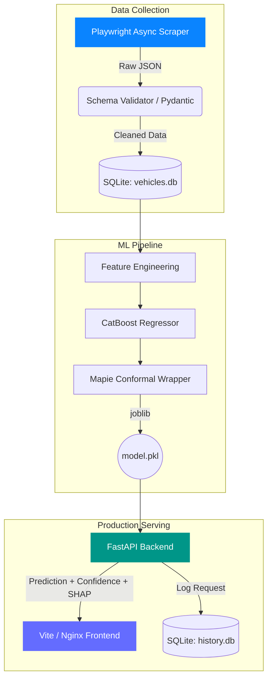

<div align="center">
  
  
  
  

  <br><br>

  <h1 align="center">CarVal - Vehicle Valuation Engine</h1>
  <p align="center">
    <strong>An enterprise-grade, full-stack vehicle valuation platform powered by Machine Learning and Conformal Prediction.</strong>
  </p>
</div>

---

## ✦ Vision

The **Precision Valuation Engine** predicts the true market value of used vehicles with production-level accuracy. We don't just output a single point estimate; we use **Mapie (Conformal Prediction)** wrapped around **CatBoost** to guarantee mathematically rigorous confidence intervals. 

---

## 📸 Platform Showcase

### 1. Cinematic Predict Interface
* **Design Philosophy:** Minimalist, deep contrast dark mode (`#000000`), glassmorphism panels, and a high-performance `<canvas>` background that scrubs through a 130-frame cinematic vehicle render based on `window.scrollY`.
* **Micro-interactions:** Tactile form inputs, instant custom bezier easing (`cubic-bezier(0.23, 1, 0.32, 1)`), and dynamic impact metrics.

### 2. Live Analytics & History Dashboard
* **Data Logging:** Every prediction payload and generated value is captured via a SQLite `history.db`.
* **The View:** A beautifully crafted, translucent table tracks prediction history in real-time, providing transparency into the model's ongoing operations.

---

## 🏗 System Architecture

The pipeline enforces strict data contracts using a canonical Pydantic schema across the entire lifecycle: from the web scraper to the training pipeline, down to the live REST API.



---

## 🚀 Quick Start (Dockerized)

The entire application (Frontend Nginx server + Backend FastAPI) is containerized for instant deployment. 

```bash
# 1. Clone the repository
git clone https://github.com/Aryan0-101/CarVal
cd precision-valuation

# 2. Spin up the full stack
docker-compose up -d --build
```

- **Frontend Application:** `http://localhost:80`
- **Backend Swagger UI:** `http://localhost:8000/docs`

---

## 🧠 Model Intelligence

We evaluated Random Forest, LightGBM, XGBoost, and CatBoost. **CatBoost** won the benchmark for its native categorical handling.

### Conformal Prediction
Standard ML models are often overconfident. We integrated `mapie.regression.CrossConformalRegressor` to output strict **90% Confidence Intervals**. If the model hasn't seen enough data for a specific 15-year-old vehicle, the interval dynamically widens to reflect structural uncertainty.

### Explainability (Pricing Factors)
Using the base estimator's `feature_importances_`, the API extracts the exact localized impact of features (e.g., Year, Mileage, Make) and renders them in the UI as green/red financial adjustments so the user understands *why* the car is priced the way it is.

---

## 🧪 Testing & Load Benchmarking

The API is hardened for production.

**Unit/Integration Tests:**
```bash
pytest -q
```
*Deterministic tests verify the prediction flows, schema enforcement, and model loading without requiring external network calls.*

**Load Testing (Locust):**
A `locustfile.py` is included in the `tests/` directory to simulate concurrent user traffic and measure CatBoost inference throughput.
```bash
pip install locust
locust -f tests/locustfile.py
# Navigate to http://localhost:8089 to start the swarm
```

---

## ☁️ Cloud Deployment

The repository is structured for zero-downtime deployment to modern cloud providers:

- **Frontend**: The Vite payload is built into static assets and served via an extremely lightweight `nginx:alpine` container.
- **Backend**: The FastAPI app is served via `uvicorn` in a `python:3.12-slim` environment.
- **CI/CD**: Fully compatible with AWS ECS (Fargate), Google Cloud Run, or Heroku container registries.

---
<div align="center">
  <p><i>Engineered for precision. Designed for impact.</i></p>
</div>
