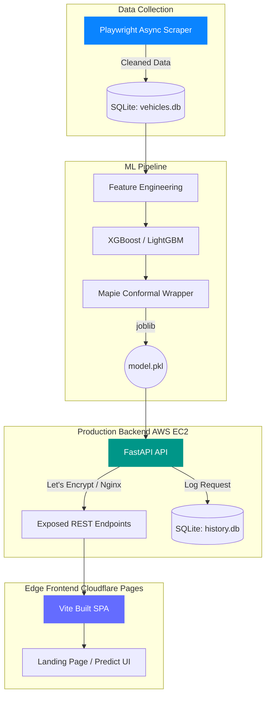

  
  
  
  

    

  <h1 align="center">CarVal - Vehicle Valuation Engine</h1>
  

    <strong>An enterprise-grade, full-stack vehicle valuation platform powered by Machine Learning and Conformal Prediction.</strong>
  

---

## ✦ Vision

The **Precision Valuation Engine** predicts the true market value of used vehicles with production-level accuracy. We don't just output a single point estimate; we use **Mapie (Conformal Prediction)** wrapped around Gradient Boosting to guarantee mathematically rigorous confidence intervals. 

---

## 📸 Platform Showcase

### 1. Cinematic Landing Experience
* **Design Philosophy:** Minimalist, deep contrast dark mode (`#0b1326`), glassmorphism panels, and a high-performance `<canvas>` background that scrubs through a 200-frame 3D cinematic vehicle render based on `window.scrollY`.
* **Architecture:** A dedicated, multi-section landing page that educates the user on Empirical Market Calibration and Data-Driven Architecture before launching the valuation engine.

### 2. Predict Interface & Analytics
* **Valuation UI:** A pristine light-mode form with tactile inputs, custom slider tracks, and instant visual feedback. 
* **Explainability:** Using SHAP-inspired feature importances, the engine outputs the exact percentage impact of each factor (like Engine Condition or Make), rendering them dynamically.
* **History Dashboard:** A beautifully crafted table tracks prediction history in real-time, backed by SQLite.

---

## 🏗 System Architecture

The system features a decoupled, globally distributed architecture:

---

## 🚀 Deployment & CI/CD

### 1. Edge Frontend (Cloudflare Pages)
The Vite frontend is automatically deployed to Cloudflare Pages via GitHub integration. Every push to `main` triggers an edge build, ensuring the UI is served with zero latency globally.

### 2. Backend API (AWS EC2)
The backend is fully containerized and hosted on an AWS EC2 instance behind an Nginx reverse proxy secured by Certbot (Let's Encrypt). 

### 3. Continuous Deployment (GitHub Actions)
A strict CI/CD pipeline is configured in `.github/workflows/deploy.yml`. When ML models or backend code are pushed to the `main` branch, a GitHub Action securely SSHes into the EC2 instance, pulls the latest code, and rebuilds the Docker containers (`docker-compose.backend.yml`) with zero manual intervention.

---

## 🧠 Model Intelligence

### Conformal Prediction
Standard ML models are often overconfident. We integrated `mapie.regression.CrossConformalRegressor` to output strict **90% Confidence Intervals**. If the model hasn't seen enough data for a specific 15-year-old vehicle, the interval dynamically widens to reflect structural uncertainty.

### Explainability (Pricing Factors)
Using the base estimator's `feature_importances_`, the API extracts the exact localized impact of features and renders them in the UI as progress bars, allowing the user to understand *why* the car is priced the way it is.

---

  
<i>Engineered for precision. Designed for impact.</i>

